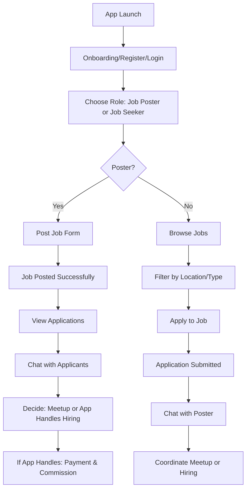

# Job Finder App Plan

## App Overview
A Flutter app connecting local job posters with job seekers in Bangladesh. Supports various job types (tuition, part-time, technician, maid, etc.). Users can post jobs, apply, and coordinate meetups or let the app handle hiring.

## Monetization Strategy
- **Primary:** Ad-supported (banner and interstitial ads) - suitable for BD market where users prefer free apps
- **Secondary:** Optional premium features (featured job posts, priority applications)
- **Tertiary:** Commission on successful hires when app handles the process (5-10% of job payment)

## Architecture
- **Frontend:** Flutter with Material Design
- **Backend:** Firebase (Auth, Firestore for data, Storage for images)
- **State Management:** Provider
- **Location:** Google Maps API for local job discovery
- **Ads:** AdMob integration
- **Payments:** Stripe or local BD payment gateway (if needed)

## User Flow Diagram

## Key Features
- User authentication (email/phone)
- Profile management
- Job posting with categories, location, pay
- Job search with filters
- Application system
- In-app messaging
- Location-based job discovery
- Ad integration
- Optional premium features

## UI/UX Principles
- Simple, clean design
- Intuitive navigation (bottom tabs)
- Card-based job listings
- Easy forms for posting/applying
- Bengali language support if needed

## Development Phases
1. Setup and authentication
2. Core job posting/search
3. Application and messaging
4. Monetization integration
5. Testing and polish
6. Play Store submission

This plan focuses on a scalable, user-friendly app that can generate revenue through ads while keeping the core experience free.